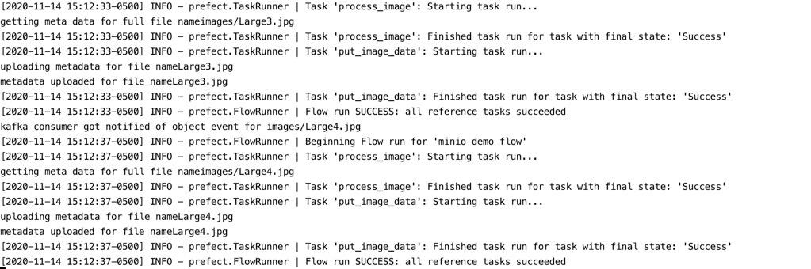
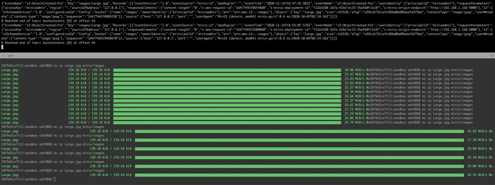
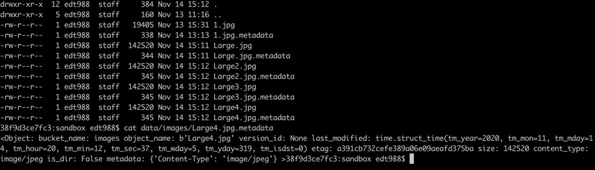

## Summary

Simple hello world program with MINIO, KAFKA, PREFECT to have a MINIO configured S3 object put event send to kafka, and then have a consumer to trigger a Prefect flow to use MINIO client to extract meta data, and then write the meta data back to same bucket

## MINIO SETUP

### Install And Running kafka 

Git clone from 
https://github.com/simplesteph/kafka-stack-docker-compose

```docker-compose -f zk-single-kafka-single.yml up```

### Optioal install kafkacat to inspect kafka topic
```brew install kafkacat```

### Install and Start minIO

```brew install minio/stable/minio```

```mkdir data```

```minio server data/```

```mc alias set minio http://127.0.0.1:9000```

note the SQS ARNs on console, for example: arn:minio:sqs::_:kafka

make a bucket called images

```mc mb minio/images```


### Configure Kafka notification event on MIN IO object create for images

```mc admin config set minio notify_kafka brokers="localhost:9092" topic="bucketevents"```

note the SQS ARN is from previous step when MINIO is started

```mc event add minio/images arn:minio:sqs::_:kafka -event put --suffix .jpg```

test copy something into the image folder

```mc cp 1.jpg minio/images```

verify we can see the object put notification with kafkacat

```kafkacat -C -b localhost:9092 -t bucketevents```

## PREFECT SETUP

```pipenv install --pre prefect```


## Running


1. With above minio and kafka running as per above set up. Run the prefect flow program
``` python3 objectPutNotificationFlow.py ```

    

 
2. use minio client copying image to bucket "images"
for example
```mc cp Large.jpg minio/images```
which triggers a s3:ObjectCreated:Put event in bucket "bucketevents"

    

3. verify meta data written to destination bucket
    


## MISC
debug.ipynb jupyter notebook file to try out code snippets

## TODO

- more Prefect native way to perform event driven triggering of flow, however this still seem to be in development #https://docs.prefect.io/core/PINs/PIN-14-Listener-Flows-2.html
- as supposed to just running locally, have the flow submit to PREFECT CLOUD
